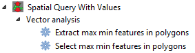

# qgis-SQV
A processing plugin for QGIS 3
This plugin adds two algorithms to the processing tool box.

These algorithms allow the user to perform a spatial query between a polygon layer and and
an additional intersecting vector layer of any geometry type. Additionally, the features extracted
from the additional layer are those which have a maximum or minimum value in a numeric attribute field
selected by the user. For example, these algorithms will extract the place with the highest or lowest
population for each country, or say you have a point layer with a field containing elevation values,
it is esy to extract the highest or lowest point in each area of an intersecting polygon layer such
as districts, survey areas etc.
Features from the additional vector input layer returned by the query can either be saved or added as
a new output layer or selected from the existing layer.
Note that both input layers should use the same co-ordinate reference system.
